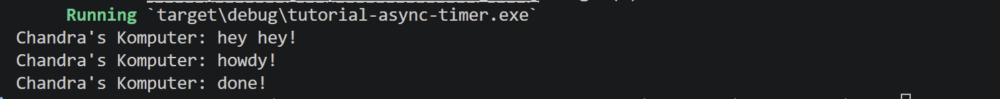

# Tutorial 10 Asynchronous Programming

### Experiment 1.2: Understanding how it works

`hey hey!` muncul sebelum `howdy!` meskipun ditulis setelah `spawner.spawn(...)`. Ini terjadi karena `spawner.spawn()` hanya mendaftarkan task ke antrian (task belum dieksekusi). Task baru dijalankan saat `executor.run()` dipanggil. Jadi kode sinkron (println! hey hey!) langsung dieksekusi duluan, baru setelah `executor.run()` dipanggil, task `async` mulai berjalan dan mencetak howdy! → menunggu 2 detik → done!.

