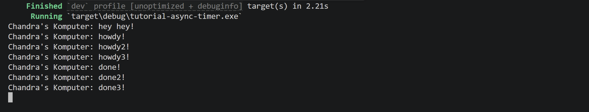
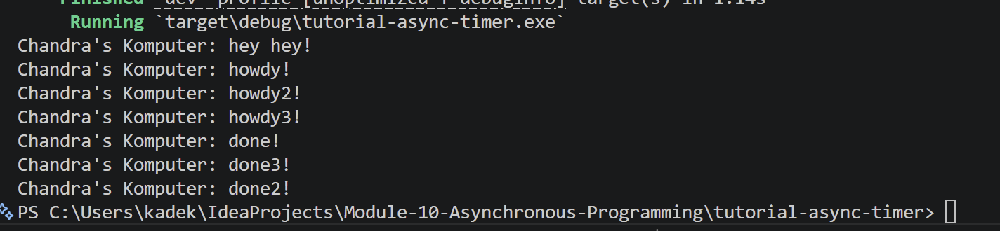

# Tutorial 10 Asynchronous Programming

### Experiment 1.2: Understanding how it works

`hey hey!` muncul sebelum `howdy!` meskipun ditulis setelah `spawner.spawn(...)`. Ini terjadi karena `spawner.spawn()` hanya mendaftarkan task ke antrian (task belum dieksekusi). Task baru dijalankan saat `executor.run()` dipanggil. Jadi kode sinkron (println! hey hey!) langsung dieksekusi duluan, baru setelah `executor.run()` dipanggil, task `async` mulai berjalan dan mencetak howdy! → menunggu 2 detik → done!.

### Experiment 1.3: Multiple Spawn and removing drop
- Spawner bertugas memasukkan task ke channel. Executor bertugas menjalankan task dari channel tersebut. executor.run() menggunakan recv() yang blocking. Ia terus menunggu task baru selama channel masih terbuka.
- drop(spawner) menutup sisi pengirim channel. Setelah itu, recv() di executor tahu tidak ada lagi task yang akan datang, sehingga loop berhenti dan program selesai.
- Jika drop(spawner) dihapus, channel tidak pernah ditutup → executor.run() menunggu selamanya → program hang.
- Dengan multiple spawn, ketiga task didaftarkan sekaligus ke antrian. Executor menjalankannya secara concurrent. Ketika Task 1 sedang await timer, Task 2 dan 3 bisa maju. Hasilnya semua howdy muncul bersamaan, lalu semua done muncul sekitar 2 detik kemudian (bukan 6 detik total).

- Tanpa `drop(spawner)` :

Program akan hangs dan tidak pernah selesai

- Menggunakan `drop(spawner)` :

Mencetak hal yang sama, tetapi setelah seluruh pesan tercetak, eksekusi selesai dan program selesai.

